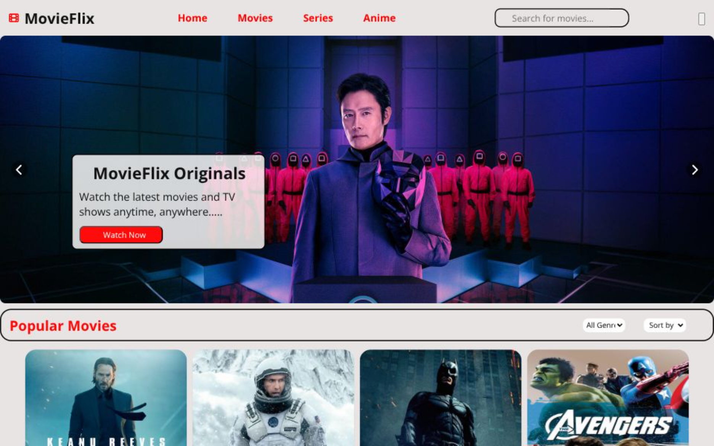

# 🎬 MovieVerse

A modern and responsive Movie Website built using HTML, CSS and JavaScript. Users can browse Movies, Web Series and Anime with search, genre filters, sorting options and Dark/Light mode.

## 🌐 Live Demo

https://movie-app-pi-roan.vercel.app/

## 📸 Screenshots




## 🚀 Features

- 🎥 Movies, Web Series & Anime sections
- 🔍 Search by title
- 🎭 Genre Filter
- ⭐ Sort by Rating
- 📅 Sort by Newest & Oldest
- 🌙 Dark / ☀️ Light Theme
- 📱 Fully Responsive Design
- 🎞️ Hero Carousel
- ⚡ Fast loading using local JSON data

## 🛠️ Tech Stack

- HTML5
- CSS3
- JavaScript (ES6)
- JSON
- Vercel (Deployment)

## 📁 Project Structure

```
MovieVerse/
│── index.html
│── style.css
│── script.js
│── db.json
│── assets/
```

## 📚 What I Learned

- Fetch API
- DOM Manipulation
- Array Filter & Sort
- Responsive Web Design
- Theme Toggle using CSS Variables
- Working with Local JSON Data

## 🔮 Future Improvements

- User Authentication
- Wishlist / Favorites
- Movie Details Page
- Backend Integration
- Database Support
- TMDB API Integration

## 👨‍💻 Author

**Anshul Gothwal**

GitHub: https://github.com/AnshulGothwal

---

⭐ If you like this project, don't forget to star the repository.
